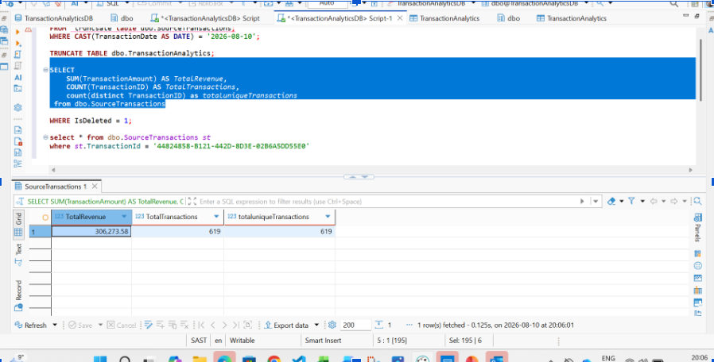
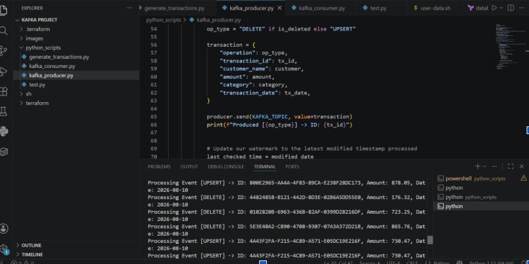
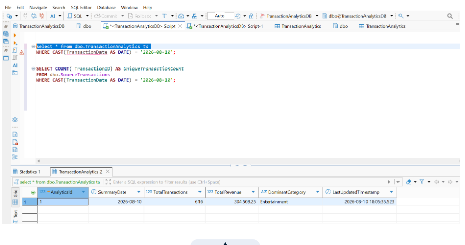

# Change Data Capture (CDC) with Kafka

## Overview

This repository demonstrates the principles of **Change Data Capture (CDC)** using **Azure, Terraform, a Linux Virtual Machine, Python, Apache Kafka, and SQL Server**.

The purpose is to demonstrate how a change made to a transactional source database can be captured and propagated to a downstream analytics table.

The demonstration focuses on a simple transaction scenario:

- A backend application is simulated by generating transaction data in a source table.
- A Python producer checks the source table for changes.
- Kafka acts as the message broker.
- A Python consumer processes the Kafka events.
- A `MERGE` operation applies the changes to the downstream analytics table.
- Soft deletes are used to preserve the original source records.

The main concept is simple:

> **When data changes in the source, downstream systems need a reliable way to know about that change and respond accordingly.**

---

# Architecture

```text
                         Azure
                           │
                           ▼
                  ┌──────────────────┐
                  │    Linux VM      │
                  │ Provisioned with │
                  │    Terraform     │
                  └────────┬─────────┘
                           │
                     Docker Compose
                           │
                  ┌────────┴─────────┐
                  │                  │
             ZooKeeper            Kafka
                                    │
                                    │
                                    ▼
Azure SQL Database ──► Python Producer ──► Kafka Topic
        │                                      │
        │                                      ▼
        │                              Python Consumer
        │                                      │
        │                                      ▼
        └──────────────────────────────► Analytics Table
```

---

# Azure Infrastructure

The infrastructure for this demonstration is hosted in **Microsoft Azure**.

A Linux Virtual Machine is used to host the Kafka environment.

Instead of manually creating the infrastructure through the Azure Portal, **Terraform** is used to provision and manage the environment.

The overall setup is:

```text
Terraform
    │
    ▼
Azure Resources
    │
    ▼
Linux Virtual Machine
    │
    ▼
Docker
    │
    ├── Kafka
    └── ZooKeeper
```

Using Terraform allows the infrastructure configuration to be stored in Git and redeployed when required.

---

# Terraform

Terraform is used as the **Infrastructure as Code (IaC)** layer.

The purpose of using Terraform is to make the environment reproducible and easier to manage.

Instead of manually configuring the VM and supporting infrastructure, the required resources are defined in Terraform configuration files.

The deployment workflow is:

```bash
terraform init
terraform validate
terraform plan
terraform apply
```

To remove the infrastructure:

```bash
terraform destroy
```

This approach allows the environment to be recreated from code rather than relying on manual configuration.

---

# Azure Virtual Machine

The Azure Linux VM acts as the host for the Kafka environment.

Once the VM is provisioned, a startup script installs Docker and Docker Compose:

```bash
apt-get update -y
apt-get install -y docker.io docker-compose-v2
systemctl start docker
systemctl enable docker
```

A deployment directory is then created:

```text
/opt/kafka
```

The Kafka Docker Compose configuration is stored in this directory.

---

# Kafka Environment

Kafka and ZooKeeper run inside Docker containers on the Azure Linux VM.

The Docker Compose configuration uses:

```text
confluentinc/cp-kafka:7.5.0
confluentinc/cp-zookeeper:7.5.0
```

The environment is structured as:

```text
Azure Linux VM
      │
      ▼
Docker
      │
      ├── ZooKeeper
      │
      └── Kafka Broker
```

The containers are started using:

```bash
docker compose up -d
```

Kafka provides the broker that receives and distributes the CDC events.

The Kafka topic used in this demonstration is:

```text
financial-transactions-cdc
```

---

# Source Database

The source database represents a transactional database used by a backend application.

The main table is:

```text
dbo.SourceTransactions
```

The table contains transaction information such as:

```text
TransactionID
CustomerName
TransactionAmount
Category
TransactionDate
IsDeleted
LastModifiedDate
```

Two fields are particularly important for this demonstration:

- `IsDeleted`
- `LastModifiedDate`

`LastModifiedDate` allows the Python producer to identify records that have changed.

`IsDeleted` is used to represent a soft delete.

---

# Python CDC Producer

The CDC mechanism in this demonstration is implemented in **Python**.

It does **not** use Debezium.

Instead, the producer uses a **timestamp-based polling approach**.

The producer maintains a watermark representing the last timestamp it processed:

```python
last_checked_time = "2026-01-01 00:00:00"
```

It then queries the source table for records modified after that timestamp:

```sql
SELECT
    TransactionID,
    CustomerName,
    TransactionAmount,
    Category,
    TransactionDate,
    IsDeleted,
    LastModifiedDate
FROM SourceTransactions
WHERE LastModifiedDate > ?
ORDER BY LastModifiedDate ASC;
```

The producer continuously checks the source table.

When a record has a newer `LastModifiedDate`, the producer identifies it as a changed record.

In this demonstration, the producer checks for changes every five seconds.

---

# Determining the CDC Operation

The producer determines the event type using the `IsDeleted` field:

```python
op_type = "DELETE" if is_deleted else "UPSERT"
```

Therefore:

```text
IsDeleted = 0
       ↓
UPSERT event
```

and:

```text
IsDeleted = 1
       ↓
DELETE event
```

The producer then publishes the event to the Kafka topic.

For example, a soft-deleted transaction is converted into a Kafka event containing information such as:

```json
{
    "operation": "DELETE",
    "transaction_id": "...",
    "customer_name": "...",
    "amount": 1000.00,
    "category": "Electronics",
    "transaction_date": "2026-08-19"
}
```

---

# Kafka's Role

It is important to distinguish between **change detection** and **event streaming**.

Kafka does not directly detect the change in the SQL database.

The **Python producer detects the change** by querying the source table using `LastModifiedDate`.

Kafka then acts as the **message broker** that transports the CDC event to downstream consumers.

```text
Azure SQL
    │
    │ Change detected by Python
    ▼
Python Producer
    │
    │ Publish CDC event
    ▼
Kafka Topic
    │
    │ Consume event
    ▼
Python Consumer
```

This creates a decoupled architecture between the transactional source and downstream systems.

---

# Soft Deletes

The demonstration uses **soft deletes** rather than physically removing records.

For example, three transactions are soft deleted using:

```sql
UPDATE dbo.SourceTransactions
SET
    IsDeleted = 1,
    LastModifiedDate = SYSDATETIME()
WHERE TransactionID IN (
    '5E3E40A2-C890-4708-9307-07A3A372D21B',
    '0102820B-6963-436B-82AF-0399D28216DF',
    '44824858-B121-442D-8D3E-02B6A5DD55E0'
);
```

Although this is technically an `UPDATE`, the `IsDeleted = 1` flag represents a business-level deletion.

The original records remain in the source database.

This provides benefits such as:

- Auditability
- Historical traceability
- Ability to investigate cancelled transactions
- Preservation of the original source record

The downstream analytics table can then exclude these records from its calculations.

---

# How the Change Travels Through the Pipeline

When the three transactions are soft deleted, the following happens:

```text
1. Source database is updated
            │
            ▼
2. LastModifiedDate changes
            │
            ▼
3. Python producer detects the change
            │
            ▼
4. IsDeleted = 1
            │
            ▼
5. Producer creates a DELETE event
            │
            ▼
6. Event is published to Kafka
            │
            ▼
7. Python consumer receives the event
            │
            ▼
8. MERGE applies the change
            │
            ▼
9. Analytics aggregation is updated
```

---

# Demonstration and Results

The following screenshots show the CDC flow and the resulting changes between the source database and the downstream analytics table.

## 1. Source Database — 619 Transactions

The source table initially contains **619 transactions**.


**Screenshot:**



The source table contains the original transaction records.

---

## 2. Soft Delete Event

Three transactions are soft deleted in the source database by setting:

```text
IsDeleted = 1
```

and updating:

```text
LastModifiedDate
```

The SQL statement used is:

```sql
UPDATE dbo.SourceTransactions
SET
    IsDeleted = 1,
    LastModifiedDate = SYSDATETIME()
WHERE TransactionID IN (
    '5E3E40A2-C890-4708-9307-07A3A372D21B',
    '0102820B-6963-436B-82AF-0399D28216DF',
    '44824858-B121-442D-8D3E-02B6A5DD55E0'
);
```

The records are not physically deleted.

Instead, the soft-delete flag allows the source records to remain available while identifying them as deleted for downstream processing.

---

## 3. Kafka Producer — Delete Events

The Python producer detects the three modified records because their `LastModifiedDate` has changed.

Since:

```text
IsDeleted = 1
```

the producer classifies them as `DELETE` events.

The events are then published to the Kafka topic:

```text
financial-transactions-cdc
```

```markdown

```

**Screenshot:**



The VS Code terminal shows the producer identifying the changes and producing the corresponding events to Kafka.


## 5. Analytics Result — 616 Transactions

After the three DELETE events have been processed, the downstream analytics table reflects the changes.

The result is:

```text
Source table       → 619 transactions
Analytics table    → 616 transactions
```

Add your analytics database screenshot showing **616 transactions** here:

```markdown

```

**Screenshot:**



The three-record difference represents the three transactions that were soft deleted in the source.

### Result

```text
619
 │
 │ 3 soft deletes
 ▼
616
```

The source retains all **619 records**, while the analytics table reflects **616 active transactions**.

---

# CDC Flow Demonstrated

The complete flow can be seen as:

```text
                    SOURCE DATABASE
                           │
                           │
                    Soft Delete
                           │
                           ▼
                   LastModifiedDate
                       changes
                           │
                           ▼
                  PYTHON PRODUCER
                           │
                    Detects change
                           │
                           ▼
                     DELETE EVENT
                           │
                           ▼
                    KAFKA TOPIC
                           │
                           ▼
                  PYTHON CONSUMER
                           │
                           ▼
                        MERGE
                           │
                           ▼
                  ANALYTICS TABLE
                           │
                           ▼
                       619 → 616
```

---

# Consumer and MERGE

The Python consumer subscribes to:

```text
financial-transactions-cdc
```

It receives events from Kafka and processes them against the downstream analytics table.

The consumer is responsible for applying the changes rather than the producer directly modifying the analytics table.

This creates a clear separation of responsibilities:

```text
Producer
   │
   │ Detect + Publish
   ▼
Kafka
   │
   │ Transport
   ▼
Consumer
   │
   │ Apply Change
   ▼
Analytics
```

The downstream table uses a `MERGE` operation to apply changes to existing records or insert new records.

Conceptually:

```sql
MERGE INTO TransactionAnalytics AS target
USING ChangedTransactions AS source
ON target.TransactionID = source.TransactionID

WHEN MATCHED THEN
    UPDATE SET
        TransactionAmount = source.TransactionAmount,
        IsDeleted = source.IsDeleted

WHEN NOT MATCHED THEN
    INSERT (
        TransactionID,
        TransactionAmount,
        IsDeleted
    )
    VALUES (
        source.TransactionID,
        source.TransactionAmount,
        source.IsDeleted
    );
```

The downstream aggregation can then exclude soft-deleted transactions:

```sql
SELECT
    SUM(TransactionAmount) AS TotalRevenue,
    COUNT(TransactionID) AS TotalTransactions,
    COUNT(DISTINCT TransactionID) AS TotalUniqueTransactions
FROM TransactionAnalytics
WHERE IsDeleted = 0;
```

---

# Why Use Soft Deletes?

The purpose of using a soft delete is to avoid physically removing the original source record.

For example:

```text
Before:

Transaction
IsDeleted = 0
```

After cancellation:

```text
Transaction
IsDeleted = 1
```

The record remains in the source table, which means it can still be used for auditing or investigation.

At the same time, downstream analytics can exclude it from calculations.

This allows the source system to retain the history while the analytics layer reflects the current business state.

---

# Project Setup

The environment is built using the following approach:

```text
Terraform
    │
    ▼
Azure
    │
    ▼
Linux VM
    │
    ▼
Docker
    │
    ├── ZooKeeper
    │
    └── Kafka
```

The application layer then connects to the infrastructure:

```text
Azure SQL
    │
    ▼
Python Producer
    │
    ▼
Kafka
    │
    ▼
Python Consumer
    │
    ▼
Analytics Table
```

This separates the infrastructure layer from the application and data-processing layer.

---

# Infrastructure as Code

Terraform is used so that the infrastructure configuration can be stored in Git.

This means the environment does not depend on manually configured Azure resources.

The infrastructure can be recreated using:

```bash
terraform init
terraform validate
terraform plan
terraform apply
```

This provides a repeatable deployment process.


# Technologies Used

| Technology | Purpose |
|---|---|
| **Microsoft Azure** | Cloud infrastructure |
| **Terraform** | Infrastructure as Code |
| **Azure Linux VM** | Hosts Kafka |
| **Docker** | Containerisation |
| **ZooKeeper** | Kafka coordination |
| **Apache Kafka** | Message broker |
| **Python** | CDC producer and consumer |
| **Azure SQL Database** | Transactional source database |
| **SQL** | Data manipulation and analytics |
| **Git** | Version control |

---

# Security

Credentials should **never** be committed directly to Git.

Database passwords, API keys, Kafka credentials, and other secrets should be stored using environment variables or a secrets-management solution.

For example:

```text
SQL_SERVER
SQL_DATABASE
SQL_USERNAME
SQL_PASSWORD
KAFKA_BOOTSTRAP_SERVERS
KAFKA_TOPIC
```

Terraform state and local configuration should also be excluded from Git:

```gitignore
.terraform/
*.tfstate
*.tfstate.*
.env
```

---

# Key Takeaway

Change Data Capture is about ensuring that **changes in a source system can be communicated to the systems that depend on that data**.

In this demonstration:

```text
Azure SQL
    ↓
Python timestamp-based CDC
    ↓
Kafka
    ↓
Python Consumer
    ↓
MERGE
    ↓
Analytics
```

Terraform provides the Infrastructure as Code layer, Azure provides the cloud environment, the Linux VM hosts Kafka, Python handles the CDC producer and consumer logic, and Kafka provides the messaging layer between the source and downstream systems.

The final result demonstrates how a change in the source can propagate through the pipeline:

```text
Source Database → 619 transactions

        ↓
   3 Soft Deletes

        ↓
   Kafka CDC Events

        ↓
      Consumer

        ↓
      MERGE

        ↓

Analytics → 616 transactions
```

The source retains the original records, while the analytics layer reflects the updated business state.

**Source → Python Producer → Kafka → Python Consumer → Analytics**

This demonstrates the core principle of **Change Data Capture**: when data changes, downstream systems need a reliable mechanism to capture and process that change.
